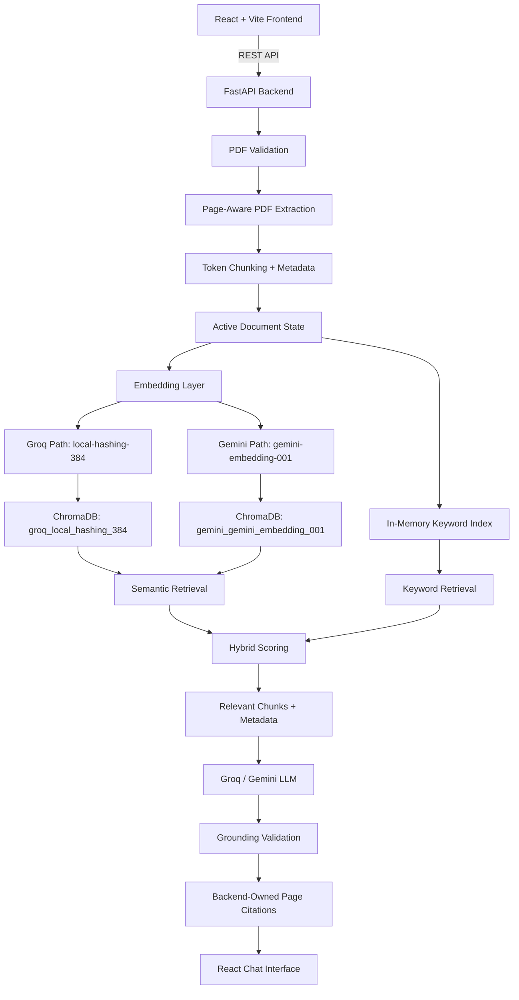

# DocuLens AI

Grounded document intelligence with hybrid retrieval and page-level citations.

## Production Demo

| Component | URL |
| --- | --- |
| Frontend | https://doculens-theta.vercel.app |
| Backend | https://doculens-ai-vgnu.onrender.com |

## Overview

DocuLens AI is a full-stack RAG application for asking questions about a single active PDF. The production frontend is a React, TypeScript, Vite, and Tailwind CSS application that communicates with a FastAPI backend over REST.

The backend validates and extracts PDF text page by page, creates metadata-rich chunks, indexes the active document in ChromaDB, combines semantic and keyword retrieval, sends only relevant context to Groq or Gemini, and returns grounded answers with backend-owned page citations.

DocuLens AI is intentionally scoped to one active PDF at a time. Uploading another PDF replaces the active document and active keyword index while preserving the same RAG architecture.

## Key Features

- Production React/Vite chat interface with TypeScript and Tailwind CSS
- FastAPI backend with structured API responses
- One active PDF at a time
- PDF validation for type, size, parseability, and page count
- Page-aware PDF extraction and chunk metadata
- ChromaDB vector storage
- Lightweight local Groq-path embeddings for constrained production memory
- Gemini embedding support through Google Generative AI embeddings
- Hybrid semantic and keyword retrieval
- Configurable retrieval limits and relevance threshold
- Groq and Gemini LLM provider support
- Grounded answer generation with insufficient-evidence fallback
- Backend-generated page citations based on retrieved metadata
- Basic follow-up question contextualization
- Frontend health status, upload state, citations, RAG details, and chat history download

## Architecture



## How It Works

1. The user selects a provider and model in the React frontend.
2. The user uploads one PDF.
3. FastAPI validates the file extension, content type, file size, PDF structure, and page count.
4. Text is extracted page by page with document and page metadata.
5. Text is split into token chunks while preserving page metadata.
6. The active provider's embedding implementation embeds the chunks.
7. Chunks and metadata are stored in the provider-specific ChromaDB collection.
8. A keyword index is created in memory for the active document.
9. User questions are sent to `/chat` with recent conversation history.
10. The backend optionally contextualizes simple follow-up questions.
11. Semantic retrieval and keyword retrieval are run against the active document.
12. Results are scored, deduplicated, filtered, and reduced to final context.
13. The selected Groq or Gemini model receives the retrieved evidence.
14. The backend validates grounding and returns either a supported answer or an insufficient-evidence response.
15. Citations are constructed from backend metadata and displayed by the frontend.

## RAG Pipeline

The backend pipeline is:

```text
PDF upload
-> validation
-> page-aware text extraction
-> token chunking
-> metadata assignment
-> embeddings
-> ChromaDB indexing
-> keyword indexing
-> query processing
-> semantic retrieval
-> keyword retrieval
-> hybrid scoring
-> context selection
-> LLM answer generation
-> grounding validation
-> citation construction
-> frontend response rendering
```

## PDF Processing

PDF processing is implemented in `server/core/document_processor.py`.

The processor verifies:

- `.pdf` filename
- configured PDF content type
- maximum file size
- readable PDF structure
- at least one page
- configured maximum page count
- exactly one uploaded file per processing request

Each extracted page receives metadata including `document_id`, `document_name`, `page_number`, `page_start`, and `page_end`. Chunks also receive a stable `chunk_id` in the form `document_id:index`.

Pages without extractable text are skipped and reported as warnings. OCR is not implemented, so image-only or scanned PDFs require an external OCR step before use.

## Embedding Strategy

Embedding behavior is implemented in `server/core/vector_database.py`.

| Provider path | Embedding implementation | Dimensions | Chroma collection |
| --- | --- | ---: | --- |
| Groq | Local deterministic hashing embeddings (`local-hashing-384`) | 384 | `groq_local_hashing_384` |
| Gemini | Google Generative AI embeddings (`gemini-embedding-001`) | Provider-defined | `gemini_gemini_embedding_001` |

The Groq path does not currently initialize `sentence-transformers/all-MiniLM-L12-v2`. The code keeps that previous model name only as a historical constant for logging. The active Groq embedding path uses a lightweight local hashing implementation to avoid the memory cost of loading a transformer embedding model on constrained Render Free instances.

The Gemini path uses `GoogleGenerativeAIEmbeddings` and requires `RAG_GOOGLE_API_KEY`.

## ChromaDB and Active Document Replacement

ChromaDB stores embedded chunks and metadata under provider-specific directories below the configured vector store root. Each provider uses a provider-specific collection name so incompatible embedding dimensions are not mixed.

The application is designed around one active PDF at a time. Internally, vector store and keyword-index caches are keyed by provider so Groq and Gemini can use their own embedding configuration. A new upload creates or loads the active provider's vector store, rebuilds the active keyword index, and updates retrieval to use the newly uploaded document. Old persisted data may remain on disk, but retrieval is scoped to the active document metadata.

## Hybrid Retrieval

Hybrid retrieval is implemented in `server/core/retrieval.py`.

The retriever combines:

- Semantic retrieval from ChromaDB
- In-memory keyword retrieval using BM25-style term statistics
- Active-document filtering by `document_id`
- Duplicate removal by `chunk_id`
- Weighted score combination
- Minimum relevance filtering
- Final top-K selection

The default score combination is:

```text
0.65 * semantic_score + 0.35 * keyword_score
```

Default retrieval settings are configured through environment variables:

| Setting | Default |
| --- | ---: |
| `RAG_SEMANTIC_TOP_K` | 8 |
| `RAG_KEYWORD_TOP_K` | 8 |
| `RAG_FINAL_TOP_K` | 5 |
| `RAG_MINIMUM_RELEVANCE_SCORE` | 0.15 |

## Grounded Answer Generation

Answer generation is implemented in `server/core/answer_generation.py`.

The backend passes the selected retrieved chunks to the LLM as evidence. The answer prompt instructs the model to answer only from the provided document context and to avoid unsupported claims.

If retrieval is not sufficiently grounded, the backend skips LLM answer construction and returns:

```json
{
  "answer": "I couldn't find this information in the uploaded document.",
  "grounded": false,
  "confidence": "low",
  "sources": []
}
```

After LLM generation, lightweight grounding validation checks the answer against retrieved evidence, including numeric consistency and evidence term overlap. If validation fails, the same insufficient-evidence response is returned.

Recent conversation history is included in prompts for context. Simple follow-up questions can also be contextualized with the previous user question.

## Source Citations

Citations are generated by the backend from retrieved chunk metadata. They are not trusted from, or invented by, the LLM.

Citation fields include:

| Field | Meaning |
| --- | --- |
| `document_id` | Active document identifier |
| `document_name` | Original PDF filename |
| `page_number` | Source page number |
| `page_start` | Start page for the chunk |
| `page_end` | End page for the chunk |
| `chunk_id` | Backend chunk identifier |
| `score` | Retrieval score |
| `retrieval_method` | `semantic`, `keyword`, or `hybrid` |

The React frontend renders these citations below grounded answers and can also show retrieval details for debugging.

## Frontend

The production frontend is in `frontend/`.

It provides:

- React 19 application built with Vite
- TypeScript API types
- Tailwind CSS styling through `@tailwindcss/vite`
- Backend API client using `VITE_API_URL`
- Health check status
- Provider and model selection
- PDF upload and processing state
- Active document display with page count
- Chat interface with history
- Markdown rendering for assistant answers
- Source citation cards
- RAG detail panel
- Chat history CSV download
- Basic retry behavior for transient network fetch failures

The Vite development server proxies `/api` to the local backend at `http://127.0.0.1:8000`.

## Backend

The backend is in `server/`.

It provides:

- FastAPI application entrypoint in `server/main.py`
- CORS configured for the production Vercel frontend
- PDF validation and extraction
- ChromaDB initialization and retrieval
- Local hashing embeddings for the Groq path
- Gemini embedding support
- Hybrid retrieval
- Groq and Gemini chat model factories
- Grounded answer generation
- Standardized response envelopes
- Safe user-facing errors with server-side logging

## API Reference

All custom API responses are wrapped in `StandardAPIResponse`.

| Method | Route | Request | Response purpose |
| --- | --- | --- | --- |
| `GET` | `/health` | None | Backend health status |
| `GET` | `/llm` | None | Available LLM providers |
| `GET` | `/llm/{model_provider}` | Path provider: `groq` or `gemini` | Available models for the provider |
| `POST` | `/upload_and_process_pdfs` | Multipart `file`, form `model_provider` | Validates, extracts, chunks, embeds, and indexes one PDF |
| `GET` | `/vector_store/count/{model_provider}` | Path provider | Number of vectors in the provider's active collection |
| `POST` | `/vector_store/search` | JSON `model_provider`, `query` | Retrieved chunks for a search query |
| `POST` | `/chat` | JSON `model_provider`, `model_name`, `message`, optional `history` | Grounded answer, citations, and retrieval details |

FastAPI also exposes its automatic OpenAPI and documentation routes when enabled by FastAPI.

## Configuration

Backend settings are defined in `server/config/settings.py` and loaded from environment variables. The backend reads `.env` from the repository root during local development.

| Variable | Required | Purpose |
| --- | --- | --- |
| `RAG_ENVIRONMENT` | No | Runtime environment label |
| `RAG_LOG_LEVEL` | No | Backend log level |
| `RAG_LLM_PROVIDER` | No | Default provider setting |
| `GROQ_API_KEY` | Required for Groq chat | Groq API key; also accepted as `RAG_GROQ_API_KEY` |
| `RAG_GOOGLE_API_KEY` | Required for Gemini | Gemini chat and embedding API key |
| `RAG_MAX_PDF_SIZE_MB` | No | Maximum accepted PDF size in MB |
| `RAG_MAX_PDF_PAGES` | No | Maximum accepted PDF page count |
| `RAG_ALLOWED_FILE_TYPE` | No | Expected PDF MIME type |
| `RAG_SEMANTIC_TOP_K` | No | Semantic retrieval candidate count |
| `RAG_KEYWORD_TOP_K` | No | Keyword retrieval candidate count |
| `RAG_FINAL_TOP_K` | No | Final retrieved context count |
| `RAG_MINIMUM_RELEVANCE_SCORE` | No | Minimum hybrid relevance threshold |
| `VITE_API_URL` | Frontend deployment setting | Frontend API base URL; defaults to `/api` locally |

Example backend `.env`:

```env
RAG_ENVIRONMENT=development
RAG_LOG_LEVEL=INFO
RAG_LLM_PROVIDER=groq
GROQ_API_KEY=your_groq_api_key_here
RAG_GOOGLE_API_KEY=your_google_api_key_here
RAG_MAX_PDF_SIZE_MB=200
RAG_MAX_PDF_PAGES=2000
RAG_ALLOWED_FILE_TYPE=application/pdf
RAG_SEMANTIC_TOP_K=8
RAG_KEYWORD_TOP_K=8
RAG_FINAL_TOP_K=5
RAG_MINIMUM_RELEVANCE_SCORE=0.15
```

Example frontend `.env`:

```env
VITE_API_URL=/api
```

For production Vercel deployment, `VITE_API_URL` should point at the Render backend.

## Project Structure

```text
.
|-- README.md
|-- .env.example
|-- client/
|   |-- app.py
|   |-- components/
|   |-- state/
|   |-- utils/
|   `-- requirements.txt
|-- frontend/
|   |-- package.json
|   |-- vite.config.ts
|   |-- src/
|   |   |-- api/
|   |   |-- components/
|   |   |-- context/
|   |   |-- types/
|   |   |-- utils/
|   |   |-- App.tsx
|   |   `-- main.tsx
|   `-- public/
|-- server/
|   |-- main.py
|   |-- requirements.txt
|   |-- api/
|   |   |-- routes.py
|   |   `-- schemas.py
|   |-- config/
|   |   `-- settings.py
|   |-- core/
|   |   |-- answer_generation.py
|   |   |-- document_processor.py
|   |   |-- llm_chain_factory.py
|   |   |-- retrieval.py
|   |   `-- vector_database.py
|   `-- utils/
|       `-- logger.py
`-- tests/
    `-- test_foundation.py
```

`client/` contains a legacy Streamlit client. The production UI is the React application in `frontend/`.

## Local Development

### Running the Backend

From the repository root:

```powershell
python -m venv .venv
.venv\Scripts\Activate.ps1
python -m pip install -r server/requirements.txt
copy .env.example .env
uvicorn server.main:app --reload
```

The local backend runs at:

```text
http://127.0.0.1:8000
```

### Running the Frontend

In a second terminal:

```powershell
cd frontend
npm install
npm run dev
```

The Vite dev server uses the `/api` proxy configured in `frontend/vite.config.ts`.

### Legacy Streamlit Client

The repository still includes a Streamlit client under `client/`:

```powershell
python -m pip install -r client/requirements.txt
cd client
streamlit run app.py
```

This client is secondary to the production React frontend.

## Testing

Backend checks:

```powershell
python -m compileall -q server client tests
python -m unittest discover -s tests -v
```

Frontend production build:

```powershell
cd frontend
npm run build
```

The existing backend tests use mocked LLM behavior where appropriate and do not require a real provider call for every test.

## Production Deployment

The current production setup is:

- Frontend on Vercel: https://doculens-theta.vercel.app
- Backend on Render: https://doculens-ai-vgnu.onrender.com

The React frontend calls the FastAPI backend using its configured API base URL. The backend CORS configuration allows the production Vercel origin.

Provider API keys must be configured only on the backend deployment environment. They are not exposed to the frontend.

## Current Limitations

- One active PDF is supported at a time.
- The application is not a multi-document knowledge base.
- OCR is not implemented, so scanned or image-only PDFs may not produce usable text.
- The keyword index is in memory for the active backend process.
- Local filesystem persistence is used for uploaded and vector data.
- Authentication and user accounts are not implemented.
- Render Free instances can cold start and have constrained memory.
- The Groq embedding path is lightweight and production-friendly, but less semantically expressive than a larger transformer embedding model.
- Grounding validation is heuristic and evidence-based, not a formal proof system.

## Security and Configuration Notes

- LLM provider API keys are read by the backend only.
- `.env` is ignored by source control.
- `.env.example` contains placeholders only.
- User-facing API errors are kept concise.
- Detailed exceptions are logged server-side.
- Uploaded files are validated before processing.
- Citations are constructed from backend metadata rather than LLM output.

## Technology Stack

| Area | Technologies |
| --- | --- |
| Frontend | React, TypeScript, Vite, Tailwind CSS |
| Backend | Python, FastAPI, Pydantic Settings |
| PDF processing | PyPDF, LangChain text splitters |
| Vector storage | ChromaDB |
| Retrieval | Chroma semantic search, in-memory BM25-style keyword retrieval |
| LLM providers | Groq through `langchain-groq`, Gemini through `langchain-google-genai` |
| Testing | Python `unittest`, FastAPI `TestClient`, mocked LLM paths |

## License

No license file is currently included in this repository.
