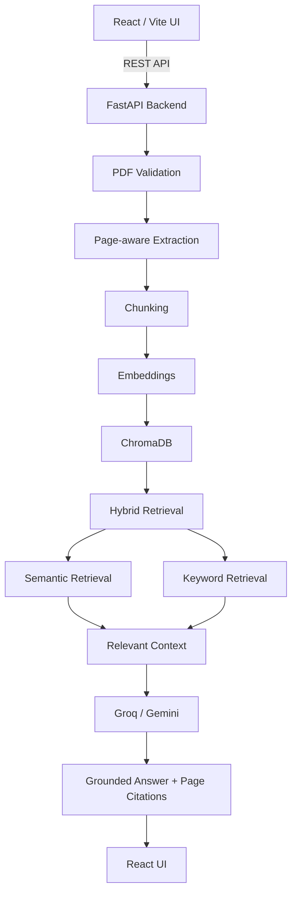

# DocuLens AI Frontend

React/Vite interface for DocuLens AI. This app handles the browser experience only: provider/model selection, PDF upload, chat, health status, citations, RAG details, and chat history export.

All PDF processing, embeddings, ChromaDB indexing, retrieval, LLM calls, grounding, and citation generation happen in the FastAPI backend.

## Stack

- React 19
- TypeScript
- Vite 8
- Tailwind CSS 4 through `@tailwindcss/vite`
- REST API integration with the FastAPI backend

## Application Flow



## Frontend Architecture

```text
frontend/
|-- package.json
|-- vite.config.ts
|-- src/
|   |-- api/
|   |   `-- client.ts
|   |-- components/
|   |   |-- ChatArea.tsx
|   |   |-- ChatInput.tsx
|   |   |-- ChatMessage.tsx
|   |   |-- RagDetails.tsx
|   |   |-- Sidebar.tsx
|   |   |-- SourceCard.tsx
|   |   `-- icons.tsx
|   |-- context/
|   |   `-- ChatContext.tsx
|   |-- types/
|   |   `-- api.ts
|   |-- utils/
|   |   |-- csvExport.ts
|   |   `-- ragFormatters.ts
|   |-- App.tsx
|   |-- index.css
|   `-- main.tsx
`-- public/
```

## Key Components

| File | Responsibility |
| --- | --- |
| `src/App.tsx` | Top-level layout with sidebar and chat area |
| `src/context/ChatContext.tsx` | Shared app state, provider/model loading, uploads, chat requests, session controls |
| `src/api/client.ts` | Typed REST client for the FastAPI API |
| `src/components/Sidebar.tsx` | Provider/model controls, PDF upload, active document status, chat history actions |
| `src/components/ChatArea.tsx` | Chat header, empty state, error display, message list, input area |
| `src/components/ChatMessage.tsx` | User/assistant message rendering, Markdown display, citations, RAG details |
| `src/components/SourceCard.tsx` | Backend citation display |
| `src/components/RagDetails.tsx` | Retrieval method, chunk count, pages, score, grounding, confidence, response time |
| `src/types/api.ts` | TypeScript types matching backend response models |
| `src/utils/csvExport.ts` | Chat history export |

## API Integration

The frontend reads its API base URL from:

```env
VITE_API_URL=/api
```

If the variable is not set, the client defaults to `/api`.

In local development, `vite.config.ts` proxies `/api` to:

```text
http://127.0.0.1:8000
```

The API client uses the backend's `StandardAPIResponse` envelope and throws user-facing errors when the backend returns an error response.

## Backend Routes Used

| Method | Route | Used for |
| --- | --- | --- |
| `GET` | `/health` | Backend online/offline status |
| `GET` | `/llm` | Available providers |
| `GET` | `/llm/{model_provider}` | Available models for the selected provider |
| `POST` | `/upload_and_process_pdfs` | Upload and process one PDF |
| `GET` | `/vector_store/count/{model_provider}` | Display current chunk count |
| `POST` | `/chat` | Ask questions and receive grounded answers |

## Runtime Behavior

- On startup, the app checks backend health and loads available LLM providers.
- Provider changes load the provider's available models.
- Uploading a PDF sends multipart form data with `file` and `model_provider`.
- A successful upload stores the active document metadata and enables chat.
- Chat requests send `model_provider`, `model_name`, `message`, and recent conversation history.
- Assistant answers render Markdown safely through React-rendered elements.
- Citations and retrieval details are rendered from backend response metadata.
- Network fetch failures are retried once after a short delay.

## Local Development

Start the backend from the repository root:

```powershell
uvicorn server.main:app --reload
```

Install and run the frontend:

```powershell
cd frontend
npm install
npm run dev
```

Open the Vite dev server URL shown in the terminal, normally:

```text
http://127.0.0.1:5173
```

## Build and Preview

```powershell
cd frontend
npm run build
npm run preview
```

## Deployment

The production frontend is deployed on Vercel:

```text
https://doculens-theta.vercel.app
```

For production, configure `VITE_API_URL` to point at the deployed FastAPI backend:

```text
https://doculens-ai-vgnu.onrender.com
```

The frontend does not store or receive Groq or Gemini API keys. Provider keys must be configured only on the backend.

## Usage

1. Confirm the backend is online.
2. Select a provider and model.
3. Upload one PDF.
4. Wait for processing to complete.
5. Ask questions about the active document.
6. Review the grounded answer, citations, and optional RAG details.
7. Download chat history if needed.

Uploading another PDF replaces the active document for the current workflow.
