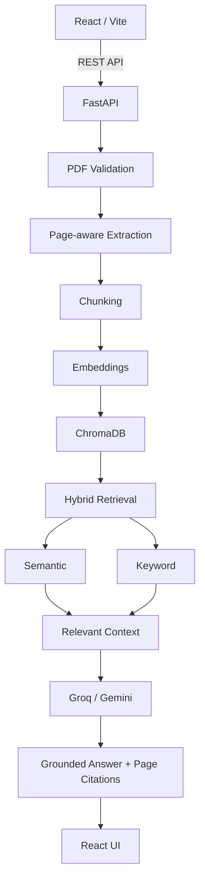

# DocuLens AI Backend

FastAPI backend for DocuLens AI. The server owns the full RAG pipeline: PDF validation, page-aware extraction, chunking, embeddings, ChromaDB indexing, hybrid retrieval, LLM answer generation, grounding validation, and page-level citations.

## Architecture Flow



## Backend Modules

```text
server/
|-- main.py
|-- requirements.txt
|-- api/
|   |-- routes.py
|   `-- schemas.py
|-- config/
|   `-- settings.py
|-- core/
|   |-- answer_generation.py
|   |-- document_processor.py
|   |-- llm_chain_factory.py
|   |-- retrieval.py
|   `-- vector_database.py
`-- utils/
    `-- logger.py
```

| File | Responsibility |
| --- | --- |
| `main.py` | FastAPI app, CORS, exception handlers, startup vector-store directory initialization |
| `api/routes.py` | Health, provider/model, upload, vector-store, search, and chat routes |
| `api/schemas.py` | Pydantic request and response models |
| `config/settings.py` | Environment-backed settings and provider/model configuration |
| `core/document_processor.py` | PDF validation, temporary upload saving, page extraction, token chunking |
| `core/vector_database.py` | Embeddings, ChromaDB access, active vector-store cache, keyword-index creation |
| `core/retrieval.py` | Semantic retrieval, keyword retrieval, hybrid scoring, filtering, serialization |
| `core/answer_generation.py` | Follow-up contextualization, prompt construction, grounding validation, citations |
| `core/llm_chain_factory.py` | Groq/Gemini LLM initialization and caching |
| `utils/logger.py` | Structured console logging |

## PDF Processing

The upload route accepts exactly one active PDF. Validation checks:

- `.pdf` filename
- accepted PDF MIME type
- configured maximum file size
- readable PDF structure
- at least one page
- configured maximum page count

Text is extracted page by page with `pypdf`. Each page document receives:

- `document_id`
- `document_name`
- `page_number`
- `page_start`
- `page_end`

The extracted pages are split with `TokenTextSplitter(chunk_size=500, chunk_overlap=50)`. Each chunk preserves document/page metadata and receives:

```text
chunk_id = document_id:index
```

Pages without extractable text are reported as warnings. Scanned or image-only PDFs require OCR outside this backend.

## Embeddings

Current embedding behavior is implemented in `core/vector_database.py`.

| Provider path | Embedding implementation | Dimensions | Chroma collection |
| --- | --- | ---: | --- |
| `groq` | Local deterministic hashing embeddings (`local-hashing-384`) | 384 | `groq_local_hashing_384` |
| `gemini` | `GoogleGenerativeAIEmbeddings` with `gemini-embedding-001` | Provider-defined | `gemini_gemini_embedding_001` |

The Groq path does not initialize the old `sentence-transformers/all-MiniLM-L12-v2` model. That previous model name exists only as a historical constant in logs. The active Groq embedding implementation is local and lightweight for constrained production memory.

Gemini embeddings require `RAG_GOOGLE_API_KEY`.

## ChromaDB

ChromaDB stores chunk text and metadata in provider-specific vector-store directories under the configured data root:

```text
data/groq_vector_store
data/gemini_vector_store
```

Provider-specific collection names prevent incompatible embedding dimensions from being mixed.

The application is designed around one active PDF at a time. On upload, the server updates the active provider's vector store cache and rebuilds the in-memory keyword index for the newly processed document. Retrieval is scoped to the active document metadata.

## Hybrid Retrieval

Hybrid retrieval is implemented in `core/retrieval.py`.

The retriever uses:

- Semantic retrieval from ChromaDB
- Keyword retrieval from an in-memory BM25-style index
- Active document filtering by `document_id`
- Duplicate handling by `chunk_id`
- Score normalization
- Weighted score combination
- Minimum relevance filtering
- Final top-K context selection

Default scoring:

```text
0.65 * semantic_score + 0.35 * keyword_score
```

Default retrieval settings:

| Environment variable | Default |
| --- | ---: |
| `RAG_SEMANTIC_TOP_K` | 8 |
| `RAG_KEYWORD_TOP_K` | 8 |
| `RAG_FINAL_TOP_K` | 5 |
| `RAG_MINIMUM_RELEVANCE_SCORE` | 0.15 |

## Groq and Gemini

LLM initialization is handled by `core/llm_chain_factory.py`.

Configured models:

| Provider | Model |
| --- | --- |
| `groq` | `openai/gpt-oss-20b` |
| `gemini` | `gemini-3.6-flash` |

Groq uses `langchain-groq`. Gemini uses `langchain-google-genai`.

API keys are read from backend environment variables only. Missing keys raise a backend error instead of producing fake success.

## Grounded Answers and Page Citations

Answer generation is implemented in `core/answer_generation.py`.

The backend:

1. Builds evidence text from retrieved chunks.
2. Sends only retrieved document evidence to the selected LLM.
3. Includes up to the last three conversation turns in the prompt.
4. Validates the answer against retrieved evidence.
5. Returns an insufficient-evidence response when retrieval or validation fails.
6. Builds citations from backend chunk metadata.

Insufficient-evidence response:

```json
{
  "answer": "I couldn't find this information in the uploaded document.",
  "grounded": false,
  "confidence": "low",
  "sources": []
}
```

Citation fields are defined in `SourceCitation`:

- `document_id`
- `document_name`
- `page_number`
- `page_start`
- `page_end`
- `chunk_id`
- `score`
- `retrieval_method`

The LLM does not control citation metadata.

## API Routes

All custom responses use the `StandardAPIResponse` shape:

```json
{
  "status": "success",
  "data": {},
  "message": null
}
```

| Method | Route | Request | Success data |
| --- | --- | --- | --- |
| `GET` | `/health` | None | `"ok"` |
| `GET` | `/llm` | None | Provider names |
| `GET` | `/llm/{model_provider}` | Path provider | Model names for provider |
| `POST` | `/upload_and_process_pdfs` | Multipart `file`, form `model_provider` | `document_id`, `filename`, `page_count`, `chunk_count`, `status`, `warnings` |
| `GET` | `/vector_store/count/{model_provider}` | Path provider | Vector count |
| `POST` | `/vector_store/search` | JSON `model_provider`, `query` | Retrieval result with chunks/context |
| `POST` | `/chat` | JSON `model_provider`, `model_name`, `message`, optional `history` | `answer`, `grounded`, `confidence`, `sources`, `retrieval` |

## Environment Variables

Settings are loaded from environment variables with the `RAG_` prefix. During local development, `.env` is read from the repository root.

| Variable | Required | Purpose |
| --- | --- | --- |
| `RAG_ENVIRONMENT` | No | Environment label |
| `RAG_LOG_LEVEL` | No | Logger level |
| `RAG_LLM_PROVIDER` | No | Default provider setting |
| `GROQ_API_KEY` or `RAG_GROQ_API_KEY` | Required for Groq chat | Groq API key |
| `RAG_GOOGLE_API_KEY` | Required for Gemini | Gemini LLM and embedding API key |
| `RAG_MAX_PDF_SIZE_MB` | No | Maximum PDF size in MB |
| `RAG_MAX_PDF_PAGES` | No | Maximum PDF page count |
| `RAG_ALLOWED_FILE_TYPE` | No | Expected PDF MIME type |
| `RAG_SEMANTIC_TOP_K` | No | Semantic retrieval candidate count |
| `RAG_KEYWORD_TOP_K` | No | Keyword retrieval candidate count |
| `RAG_FINAL_TOP_K` | No | Final context chunk count |
| `RAG_MINIMUM_RELEVANCE_SCORE` | No | Minimum hybrid relevance score |

Example:

```env
RAG_ENVIRONMENT=development
RAG_LOG_LEVEL=INFO
RAG_LLM_PROVIDER=groq
GROQ_API_KEY=your_groq_api_key_here
RAG_GOOGLE_API_KEY=your_google_api_key_here
RAG_MAX_PDF_SIZE_MB=200
RAG_MAX_PDF_PAGES=2000
RAG_ALLOWED_FILE_TYPE=application/pdf
RAG_SEMANTIC_TOP_K=8
RAG_KEYWORD_TOP_K=8
RAG_FINAL_TOP_K=5
RAG_MINIMUM_RELEVANCE_SCORE=0.15
```

## Local Setup

From the repository root:

```powershell
python -m venv .venv
.venv\Scripts\Activate.ps1
python -m pip install -r server/requirements.txt
copy .env.example .env
uvicorn server.main:app --reload
```

The backend runs locally at:

```text
http://127.0.0.1:8000
```

## Deployment

The current backend deployment target is Render:

```text
https://doculens-ai-vgnu.onrender.com
```

Configure provider API keys and RAG settings in the Render environment. The React frontend deployment must point `VITE_API_URL` at this backend URL.

## Notes

- The backend supports one active PDF workflow, not a multi-document knowledge base.
- OCR is not implemented.
- The keyword index is in memory for the active process.
- User-facing errors are concise; detailed exceptions are logged server-side.
- Provider API keys are never returned to the frontend.
